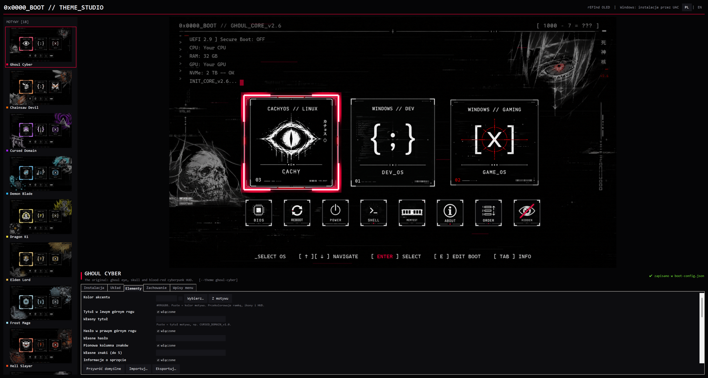
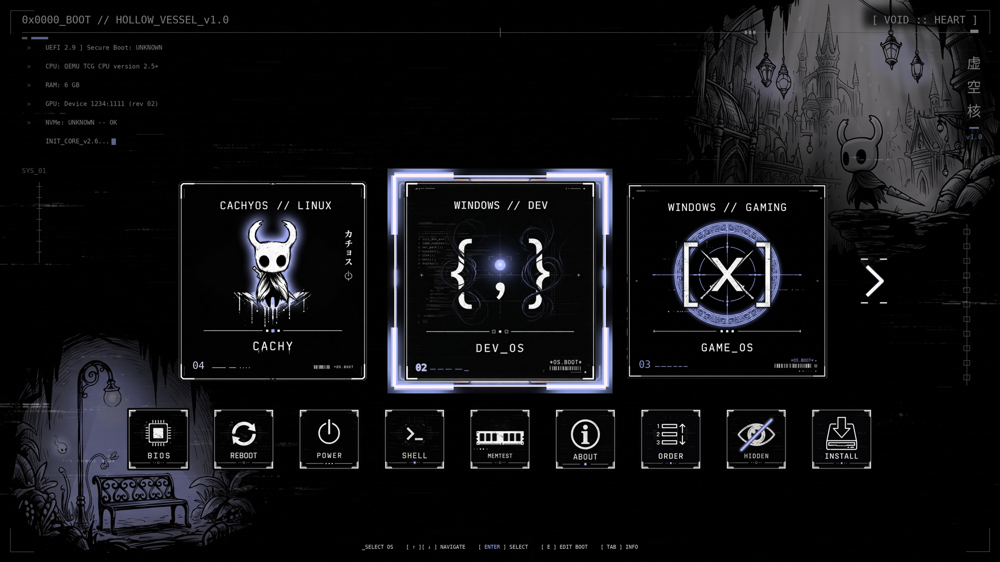

# Ghoul Cyber – Theme Studio

[🇬🇧 English](README.md) | **🇵🇱 Polski**

> **Własny ekran startowy rEFInd w kilka minut: wybierz jeden z 18 motywów, dopasuj go z podglądem na żywo i zbuduj albo zainstaluj jednym kliknięciem — na Linuksie i Windowsie.**

[](https://github.com/Dismonder/ghoul-cyber-theme-studio/releases/latest)
[](https://github.com/Dismonder/ghoul-cyber-theme-studio/releases)
[](https://github.com/Dismonder/refind-theme-ghoul-cyber)
[](LICENSE)




---

## ☕ Wesprzyj projekt (Support the Author)

Jeśli Theme Studio oszczędziło Ci wieczoru ręcznego grzebania w `refind.conf` albo po prostu podoba Ci się, jak teraz wygląda Twój ekran startowy — możesz docenić pracę i postawić wirtualną kawę:

[-37AC49?style=for-the-badge&logo=buy-me-a-coffee&logoColor=white)](https://buycoffee.to/dismonder)
[](https://ko-fi.com/dismonder)
[](https://patronite.pl/Dismonder)
[](https://github.com/sponsors/Dismonder)

- 🇵🇱 **[BuyCoffee.to/dismonder](https://buycoffee.to/dismonder)** – szybka kawa w PLN (BLIK, karta, Apple Pay / Google Pay).
- 🌍 **[Ko-fi.com/dismonder](https://ko-fi.com/dismonder)** – wsparcie zagraniczne (PayPal / karty, 0% prowizji platformy).
- 🏆 **[Patronite.pl/Dismonder](https://patronite.pl/Dismonder)** – comiesięczne wsparcie patronackie / subskrypcja.
- 🐙 **[GitHub Sponsors (Dismonder)](https://github.com/sponsors/Dismonder)** – bezpośredni program sponsoringu GitHub.

---

## ⬇️ Pobieranie i uruchomienie

Pobierz **`ghoul-cyber-theme-studio-<wersja>.zip`** z **[Wydań (Releases)](https://github.com/Dismonder/ghoul-cyber-theme-studio/releases/latest)** — w środku jest już silnik motywu i wszystkie 18 motywów.

| System | Uruchomienie |
| :--- | :--- |
| **Windows 10 / 11** | Zainstaluj [Pythona 3](https://www.python.org/downloads/) (zaznacz *Add to PATH*), potem kliknij dwukrotnie **`ThemeStudio.bat`** — Pillow doinstaluje się przy pierwszym starcie. |
| **Linux** | `./theme-studio.sh` — potrzebny Python 3 i Tk (`sudo pacman -S tk` · `sudo apt install python3-tk` · `sudo dnf install python3-tkinter` · `sudo zypper install python3-tk`). Resztę program doinstaluje sam. |

Z gita (silnik jest submodułem, więc klonuj rekurencyjnie):

```bash
git clone --recursive https://github.com/Dismonder/ghoul-cyber-theme-studio.git
cd ghoul-cyber-theme-studio
python3 theme_studio.py
```

---

## ✨ Co potrafi

| | |
| :--- | :--- |
| 🎨 **18 motywów** | Oryginalny Ghoul Cyber i 17 alternatywnych motywów OLED — każdy z własną grafiką, kafelkami systemów i kolorem akcentu. |
| 👀 **Podgląd na żywo** | Końcowy ekran rEFInd odświeża się chwilę po każdej zmianie — kafelki, rząd narzędzi, HUD, numeracja, strzałki. |
| 🧩 **Każda opcja jako formularz** | Rozdzielczość, rozmiary kafelków, ile kafelków systemów widać naraz, strzałki przewijania, teksty HUD i wiersze sprzętu, numery kafelków i ich kolejność, narzędzia w dolnym rzędzie, czas do startu, domyślny system, własne wpisy menu. Pod każdym polem opis. |
| 🛠️ **Zbuduj albo zainstaluj jednym kliknięciem** | **ZBUDUJ** tworzy paczkę, **ZBUDUJ I ZAINSTALUJ** wgrywa ją od razu do rEFInd, **próba na sucho** tylko pokazuje, co by się stało. Log na żywo; na pytania instalatora odpowiadasz w aplikacji. |
| 🐧 **Każdy popularny Linux** | pacman, apt, dnf, zypper, xbps, apk. Pyta o hasło sudo we własnym okienku, doinstalowuje, czego brakuje — **nawet sam rEFInd** — i dodaje EFI Shell oraz MemTest86+ do rzędu narzędzi. |
| 🪟 **Windows** | Prosi o uprawnienia administratora (UAC), sam znajduje partycję EFI, na której naprawdę jest rEFInd, nadaje jej tymczasową literę i potem ją usuwa. |
| 🛡️ **Odporność na błędy** | Złe wartości są pokazywane na czerwono i blokują budowanie, ostatnie poprawne ustawienia nigdy nie są nadpisywane, każda awaria podczas instalacji cofa wszystkie pliki, a `refind.conf` ma kopię `.bak` z datą. |
| 🌍 **Polski / English** | Zgodnie z językiem systemu; przełącznik **PL \| EN** w prawym górnym rogu (wymuszenie: `GHOUL_LANG=pl` / `en`). |
| 💾 **Podziel się wyglądem** | Ustawienia zapisują się same; **Importuj / Eksportuj** przenosi cały wygląd jednym plikiem. |

### Efekt — prawdziwy rEFInd

Zainstalowany przez Theme Studio, sfotografowany w maszynie wirtualnej UEFI: Twoje systemy ponumerowane, dziewięć działających narzędzi z jedną wspólną ramką, strzałki przewijania, gdy nie wszystkie systemy się mieszczą.



---

## 👤 Autor i Podpis (Author & Signature)

- **Autor / Creator:** **Dismonder**
- **Silnik motywu:** [Dismonder/refind-theme-ghoul-cyber](https://github.com/Dismonder/refind-theme-ghoul-cyber)
- **Wydania / Releases:** [Releases](https://github.com/Dismonder/ghoul-cyber-theme-studio/releases)
- **Copyright:** © 2026 Dismonder. Wszystkie prawa zastrzeżone / All Rights Reserved.
- **Licencja:** [Ghoul Cyber Protective License (GCPL-1.0)](LICENSE)

---

## 📜 Licencja (License Summary)

Theme Studio jest częścią projektu Ghoul Cyber i obejmuje je ta sama licencja ochronna **GCPL-1.0 (Ghoul Cyber Protective License)**:

✅ **Co MOŻESZ robić:**
- Bezpłatnie pobierać, instalować i używać Theme Studio na własnych urządzeniach.
- Modyfikować pliki i ustawienia na własny, prywatny użytek.

❌ **Czego KATEGORYCZNIE NIE WOLNO robić:**
- **ZAKAZ ROZPOWSZECHNIANIA POD WŁASNYMI INICJAŁAMI / NAZWISKIEM:** Zabrania się publikowania, udostępniania i re-uploadu programu pod własnym nazwiskiem, inicjałami, pseudonimem, marką lub jako rzekomo własnego projektu.
- **ZAKAZ USUWANIA DANYCH AUTORA:** Zabrania się usuwania lub zamazywania podpisu, pseudonimu `Dismonder`, not prawno-autorskich i pliku licencji.
- **ZAKAZ UŻYTKU KOMERCYJNEGO:** Zabrania się sprzedaży, pobierania opłat lub dołączania programu do płatnych pakietów bez pisemnej zgody autora.

Pełny, prawnie wiążący tekst licencji w języku polskim i angielskim znajduje się w pliku [LICENSE](LICENSE).

---

## 🔗 Jak to jest połączone

```
ghoul-cyber-theme-studio/        ← to repozytorium (aplikacja)
├── theme_studio.py              Theme Studio
├── studio_i18n.py               teksty polskie / angielskie
├── ThemeStudio.bat              uruchamianie na Windowsie
├── theme-studio.sh              uruchamianie na Linuksie
└── theme/                       submoduł git → refind-theme-ghoul-cyber
    ├── build_and_deploy_theme.py   generator + instalator (działa też z wiersza poleceń)
    └── themes/                     17 alternatywnych motywów
```

Submoduł jest przypięty do sprawdzonej wersji silnika motywu. Najnowszy: `git submodule update --remote theme`.

---

## 🎭 Fan art

17 z 18 motywów to nieoficjalny, niekomercyjny fan art inspirowany popularnymi anime i grami — niepowiązany z twórcami ani właścicielami praw i niewspierany przez nich; wszystkie postacie i znaki towarowe należą do ich właścicieli. Theme Studio oznacza je jako *FAN ART*. Właściciele praw mogą poprosić o usunięcie przez zgłoszenie (issue) — zobacz [`FAN-ART.md`](https://github.com/Dismonder/refind-theme-ghoul-cyber/blob/main/themes/FAN-ART.md).

---

## 🧪 Testy

```bash
python3 -m pytest tests                       # Linux bez ekranu: xvfb-run -a python3 -m pytest tests
FUZZ_ROUNDS=200 python3 -m pytest tests       # mocniejszy test losowych danych (powtórka: FUZZ_SEED=…)
```

Każde wydanie buduje GitHub Actions: najpierw testy, potem gotowe archiwum z `SHA256SUMS.txt`.
