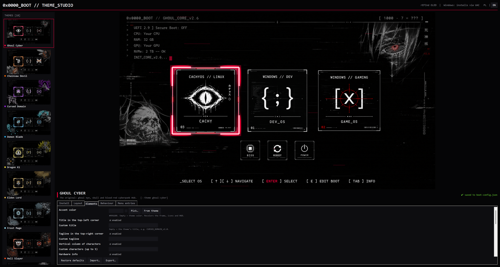

# 👁️ Ghoul Cyber — Theme Studio

[🇬🇧 English](README.md) | **🇵🇱 Polski**

Własny ekran startowy **rEFInd** w kilka minut: wybierasz motyw, dopasowujesz go z **podglądem na żywo** i budujesz albo instalujesz jednym kliknięciem. Theme Studio to aplikacja do [**motywu Ghoul Cyber dla rEFInd**](https://github.com/Dismonder/refind-theme-ghoul-cyber) — 18 motywów OLED, generator rysujący ekran pod Twój komputer i instalator działający na każdym popularnym Linuksie oraz na Windowsie.



---

## ⬇️ Pobieranie i uruchomienie

Pobierz **`ghoul-cyber-theme-studio-<wersja>.zip`** z [Wydań (Releases)](https://github.com/Dismonder/ghoul-cyber-theme-studio/releases/latest) — w środku jest już silnik motywu i wszystkie motywy.

| System | Uruchomienie |
| :--- | :--- |
| **Windows** | Zainstaluj [Pythona 3](https://www.python.org/downloads/) (zaznacz *Add to PATH*), potem kliknij dwukrotnie **`ThemeStudio.bat`** — Pillow doinstaluje się przy pierwszym starcie. |
| **Linux** | `./theme-studio.sh` — potrzebny Python 3 i Tk (`sudo pacman -S tk` · `sudo apt install python3-tk` · `sudo dnf install python3-tkinter` · `sudo zypper install python3-tk`). Brakujące pakiety do budowania instalują się same. |

Z gita (silnik jest submodułem):

```bash
git clone --recursive https://github.com/Dismonder/ghoul-cyber-theme-studio.git
cd ghoul-cyber-theme-studio
python3 theme_studio.py
```

---

## ✨ Co potrafi

- **Motywy** po lewej, po prawej podgląd na żywo końcowego ekranu rEFInd (odświeża się chwilę po każdej zmianie).
- Zakładka **Instalacja**: **ZBUDUJ** (paczka w `theme/dist/ghoul-cyber`) albo **ZBUDUJ I ZAINSTALUJ** (od razu do rEFInd) oraz **próba na sucho**, która tylko pokazuje, co by się stało. Log na żywo; na pytania instalatora odpowiadasz w polu pod logiem.
  - **Linux:** pyta o hasło sudo we własnym okienku; brakujące pakiety instaluje menedżerem pakietów Twojej dystrybucji, a jeśli nie masz jeszcze rEFInd — **instaluje go**.
  - **Windows:** prosi o uprawnienia administratora (UAC), sam znajduje partycję EFI, na której naprawdę jest rEFInd, nadaje jej tymczasową literę i potem ją usuwa.
- Zakładki **Układ / Elementy / Zachowanie / Wpisy menu** — wszystkie opcje motywu jako formularz z opisami: rozdzielczość, rozmiary kafelków, ile kafelków systemów widać naraz, strzałki przewijania, teksty i wiersze HUD, numery kafelków i ich kolejność, narzędzia w dolnym rzędzie, czas do startu, domyślny system, własne wpisy menu…
- **Odporność na błędy:** złe wartości są pokazywane na czerwono i blokują budowanie, ostatnie poprawne ustawienia nigdy nie są nadpisywane, a każda awaria podczas instalacji cofa wszystkie pliki (`refind.conf` ma też kopię `.bak` z datą).
- Ustawienia zapisują się same; **Importuj / Eksportuj** pozwala podzielić się całym wyglądem jako jednym plikiem.
- **Język:** polski, gdy system jest po polsku, w innym przypadku angielski — przełącznik **PL | EN** w prawym górnym rogu. Wymuszenie: `GHOUL_LANG=pl` / `GHOUL_LANG=en`.
- Bez Tk uruchamia się menu tekstowe.

---

## 🔗 Jak to jest połączone

```
ghoul-cyber-theme-studio/        ← to repozytorium (aplikacja)
├── theme_studio.py              Theme Studio
├── studio_i18n.py               teksty polskie / angielskie
└── theme/                       submoduł git → refind-theme-ghoul-cyber
    ├── build_and_deploy_theme.py   generator + instalator (działa też z wiersza poleceń)
    ├── themes/                     17 alternatywnych motywów
    └── …
```

Submoduł jest przypięty do sprawdzonej wersji motywu. Najnowszy silnik: `git submodule update --remote theme`.

---

## 🎭 Fan art

17 z 18 motywów to nieoficjalny, niekomercyjny fan art inspirowany popularnymi anime i grami — niepowiązany z twórcami ani właścicielami praw; wszystkie postacie i znaki towarowe należą do ich właścicieli. Theme Studio oznacza je jako *FAN ART*. Zobacz [`theme/themes/FAN-ART.md`](https://github.com/Dismonder/refind-theme-ghoul-cyber/blob/main/themes/FAN-ART.md).

## 📜 Licencja

**GHOUL CYBER PROTECTIVE LICENSE (GCPL-1.0)** — © 2026 Dismonder. Do użytku osobistego za darmo; podpis i nazwa autora muszą pozostać nienaruszone. Pełny tekst w pliku [LICENSE](LICENSE).
